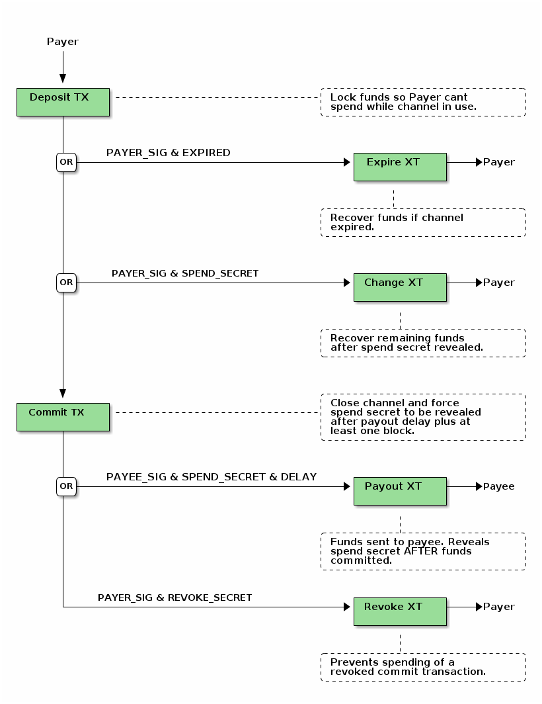

# Trustless micropayment channels ᕕ( ᐛ )ᕗ

## Protocol

### Deposit Transaction

The deposit transaction ensures the payee cannot spend the funds while
the channel is open.

The pay to script allows for three possible outcoms:

 - The payer can recover the deposit after a timeout if no commit was made.
 - Both parties commit and close the channel.
 - The payer collects the change after the payee publishes the spend secret.

**The commit transaction spend secret must be the same as the deposit
transaction spend secret!**

pay to script:

    OP_IF
        2 <payer pubkey> <payee pubkey> 2 OP_CHECKMULTISIG
    OP_ELSE
        OP_IF
            OP_HASH160 <spend secret hash> OP_EQUALVERIFY
            <payer pubkey> OP_CHECKSIG
        OP_ELSE
            <expire time> OP_CHECKSEQUENCEVERIFY OP_DROP
            <payer pubkey> OP_CHECKSIG
        OP_ENDIF
    OP_ENDIF

### Expire Transaction

The expire transaction is used by the payee to recover the and funds after
the channel expires. This is to prevent funds being lost should the payee
be hit by a bus.

script sig:

    <payer signature> OP_FALSE OP_FALSE

    # Example: 796637e788db8d3430ae48ec057ef493a871b7abc4711f9bb5f6148efc2212e7

### Change Transaction

After the commit transaction has been published on the blockchain, the
payee must reveal the spend secret to spend the committed funds. The payer
can then recover the change from the channel before it times out by using the
revealed spend secret.

script sig:

    <payer signature> <spend secret> OP_TRUE OP_FALSE

    # Example: a6fdd23b2e5b1153cbd358c362456263531451b80ab4a597f7aa122cecc52703

### Commit Transaction

The commit transaction is used to transfer funds and prevent a race condition
between the payee recovering the payout and the payer recovering the change.

Every time the payer wishes to transfer funds to the payee, the output amount
of the transaction is increased. The payee then signs and shares it.

To ensure the payer can recover the change without having to wait for the
channel to expire, the payee must reveal the spend secret when spending the
payout. **The commit transaction spend secret must be the same as the deposit
transaction spend secret!**

The transaction also enables spending by the payer if the transaction was
revoked by the payee (revealed the revolk signature). This prevents the payee
from publishing a revoked transaction.

script sig:

    OP_FALSE <payer signature> <payee signature> OP_TRUE

    # Example: 34f7abf7474de02abdbff63e1718477d33c20d457e9881e2087c3d79f6517d1c

pay to script:

    OP_IF
        <delay time> OP_CHECKSEQUENCEVERIFY OP_DROP
        OP_HASH160 <spend secret hash> OP_EQUALVERIFY
        <payee pubkey> OP_CHECKSIG
    OP_ELSE
        OP_HASH160 <revoke secret hash> OP_EQUALVERIFY
        <payer pubkey> OP_CHECKSIG
    OP_ENDIF

### Payout Transaction

The payout transaction is used by the payee to spend the commited funds. In
order to spend the funds the payee must reveal the spend secret, this ensures
the payer can recover the change.

The payout can only be done after a delay to ensure the payer has time to
react if the payee tries to publish a revoked commit transaction.

script sig:

    <payee signature> <spend secret> OP_TRUE

    # Example: 52a86445bf72b193cd351e2477cac9177d5c8fb4a637226b11811f7068e67fe8

### Revoke Transaction

If the payee tries to publish a revoked commit transaction, the payer can
recover the funds during the payout delay using the revolk secret.

script sig:

    <payer signature> <revoke secret> OP_FALSE

    # Example: c368ff17683f0720ea3e2c06bb0c70e3b0c381e7df5b6c10b28bfad5433a3b8c
